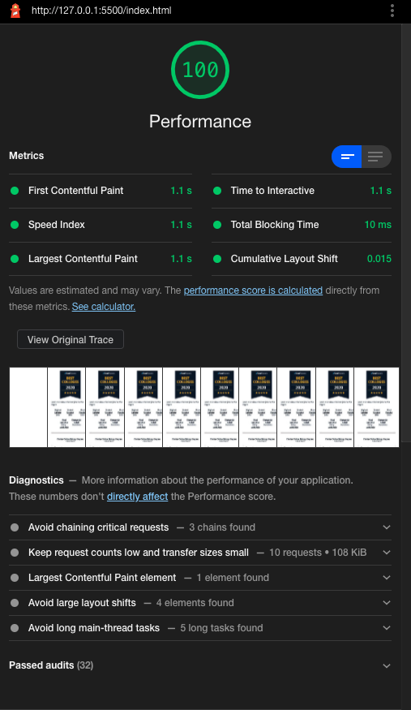
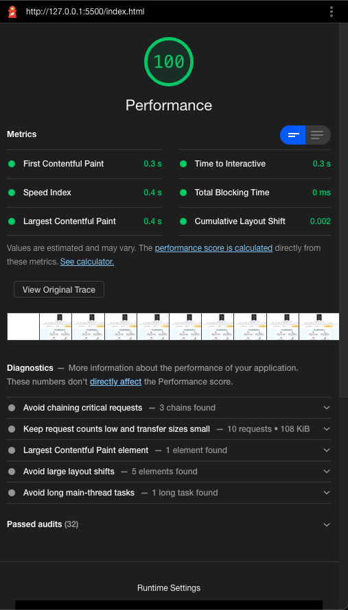

# html-css-assessment

## Screenshots

Mobile:

Desktop:

## Notes
- SASS is in `styles` folder and is compiled to `assets/stylesheets`
- Fonts were packaged with Parcel and are compiled to `dist` folder
- I was using Parcel for my workflow, but it wasn't building properly (I'm not at my home setup at the moment), so the organization is less than ideal
- This project lends itself surprisingly nicely to my system (not all projects do).
